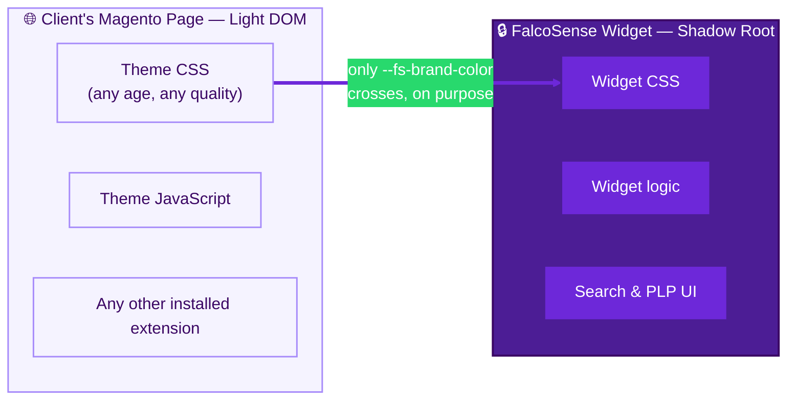
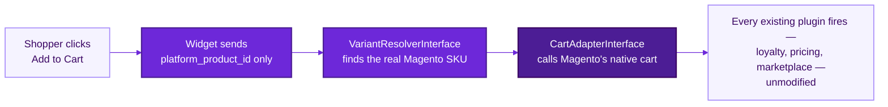
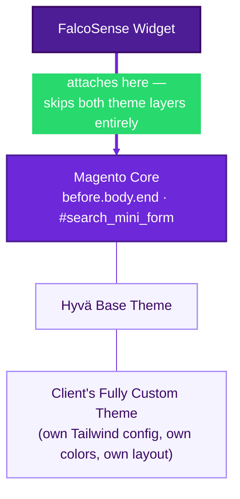
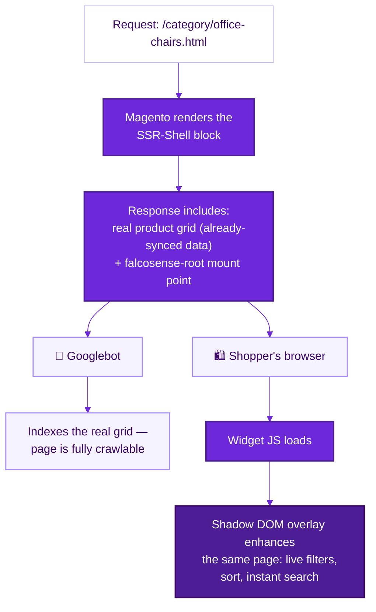
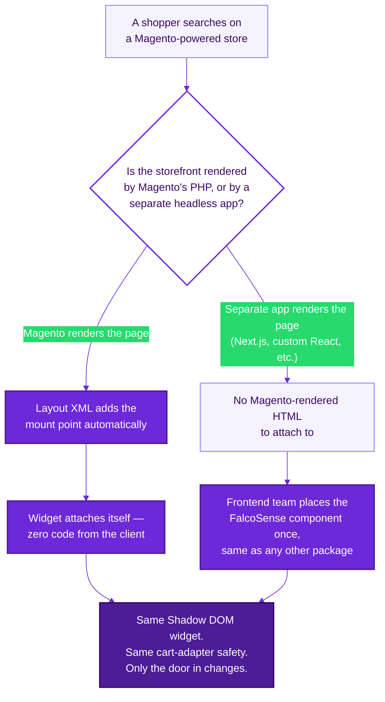
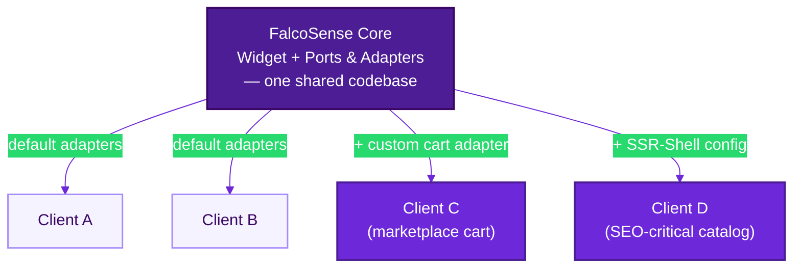

```mermaid
%%{init: {'theme':'base', 'themeVariables': {'primaryColor':'#6D28D9','primaryTextColor':'#ffffff','primaryBorderColor':'#4C1D95','lineColor':'#ffffff','fontFamily':'Helvetica Neue, Arial, sans-serif'}}}%%
flowchart LR
    subgraph OLD["Old Approach — 5 ways to reach in"]
        direction TB
        O1["Remove native blocks by name"]
        O2["Replace whole templates"]
        O3["Edit theme's core files directly"]
        O4["Fight theme CSS with !important"]
        O5["Hope the theme never changes"]
    end

    subgraph NEW["Additive Only — 2 mechanisms, both safe"]
        direction TB
        N1["Add one block to before.body.end"]
        N2["Attach to the native search input"]
    end

    OLD -.->|"replaced by"| NEW

    classDef bad fill:#6D28D9,stroke:#3B0764,stroke-width:1.5px,color:#ffffff
    classDef good fill:#ffffff,stroke:#4C1D95,stroke-width:2px,color:#3B0764

    class OLD,O1,O2,O3,O4,O5 bad
    class NEW,N1,N2 good
```

# FalcoSense Target Architecture — Slide Deck Content

*Hand this file to Claude (or any AI slide generator) with the instruction: "build a PowerPoint from this, one slide per `## Slide N` section, following the design brief exactly." Each slide is self-contained by design — none of them reference "the previous slide" — so removing any single slide from the middle of the deck leaves the rest fully coherent.*

---

## Design Brief — read this before building any slide

**Palette (use exactly these, nothing else):**
- `#4C1D95` — Deep Purple (primary brand color, full-bleed "punch" slide backgrounds, headline accents)
- `#6D28D9` — Accent Purple (active/highlighted elements, buttons, key stat numbers)
- `#A78BFA` — Light Purple (secondary text on dark backgrounds, subtle accents on light slides)
- `#F5F3FF` — Lavender Tint (card/box backgrounds on light slides, never pure grey)
- `#FFFFFF` — White (primary background for most slides, primary text on dark slides)
- `#3B0764` — Ink (body text on light slides — a purple-biased near-black, never pure black or grey)

**Two slide modes, used deliberately for rhythm — not every slide the same:**
- **Light mode** (white background, `#3B0764` body text, `#4C1D95` headlines, `#F5F3FF` boxes/cards) — the default, used for explanation/evidence slides.
- **Punch mode** (full-bleed `#4C1D95` background, white headline text, `#A78BFA` secondary text) — reserved for exactly three slides: the title, "The One Rule," and the close. These are the three moments meant to land hardest — don't dilute them by using this mode elsewhere.

**Typography:** Bold, tight, geometric sans-serif for headlines (Poppins SemiBold/Bold or Montserrat Bold register); clean, highly legible sans-serif for body (Inter or Helvetica Neue register). Headlines are short declarative sentences, not labels — they should be readable as a standalone claim even with the rest of the slide covered up.

**Layout discipline:** One idea per slide. Maximum 4 bullets where bullets appear at all. Generous white space — do not shrink type to fit more text; cut text instead. When a slide has a diagram, the diagram is the visual center of the slide, not a small inset.

**Tone on-slide:** Declarative and confident. No hedging, no "we believe," no question marks in headlines. Nuance, caveats, and honesty about open gaps belong in the presenter's spoken delivery (see the companion presenter's guide) — the slide text itself always states the point directly.

**Footer:** small "FalcoSense" wordmark + slide number, bottom right, on every slide — `#A78BFA` on punch-mode slides, `#4C1D95` on light-mode slides.

---

## Slide 1 — Title

**Mode:** Punch (full-bleed deep purple)
**Layout:** Centered typographic title slide. No bullets, no diagram, no logo clutter — just the statement.

**On-slide text:**
# The Search Module That Can't Break Your Site
### FalcoSense — Target Architecture

---

## Slide 2 — The Ambition

**Mode:** Light
**Layout:** Headline top, one large stat callout center, 3 short bullets below.

**On-slide text:**
# 10 Minutes. Any Magento Site. Zero Exceptions.

**Stat callout (large, `#6D28D9`):** 10–12 hours → 10 minutes

- Drop in the module, enter an API key — done
- No layout edits, no theme work, no coordinating with what's already installed
- Works whether the site is clean or held together by four years of freelancer patches

---

## Slide 3 — What Went Wrong (and What We Keep)

**Mode:** Light
**Layout:** Headline top, 3 bullets, no diagram.

**On-slide text:**
# What Went Wrong — And What We Were Already Doing Right

- Everest broke because we removed native blocks, rewrote a core Magento template in place, and fought theme CSS with `!important`
- Real, working patterns already exist in our own code — a cache-aware token endpoint, real data-integrity checks — we're promoting them, not throwing everything out
- This is the fix for a documented failure, not a rewrite for its own sake

---

## Slide 4 — The One Rule

**Mode:** Punch (full-bleed deep purple)
**Layout:** Large centered statement, diagram below it, minimal supporting text.

**On-slide text:**
# One Rule Generates Everything Else

**Large centered statement:**
> FalcoSense only ever *adds*.
> It never removes, replaces, or overrides anything that belongs to someone else.

**Diagram:**

---

## Slide 5 — Shadow DOM

**Mode:** Light
**Layout:** Headline top, diagram center-right, 3 bullets left.

**On-slide text:**
# A Sealed Boundary the Browser Enforces — Not Us

- The widget renders inside a genuinely separate DOM boundary — Shadow DOM
- Host CSS and JS cannot reach in; our CSS and JS cannot leak out
- One deliberate exception: brand color and font, passed through on purpose

**Diagram:**

---

## Slide 6 — Attach, Don't Replace

**Mode:** Light
**Layout:** Headline top, 3 bullets, no diagram — intentionally text-only for pacing.

**On-slide text:**
# We Don't Replace the Search Box. We Listen to It.

- Magento's native search input has one stable, framework-wide contract — not a theme convention
- The widget attaches a listener to it — never moves it, wraps it, or replaces it
- The client's existing search still works exactly as it did before, completely untouched

---

## Slide 7 — Fail-Open, Not Fail-Broken

**Mode:** Light
**Layout:** Headline top, 3 bullets, no diagram.

**On-slide text:**
# When Something Fails, the Site Doesn't Know We Exist

- Native rendering always loads first, untouched
- FalcoSense only takes over after proving it has real data
- Any failure — bad token, slow platform, a JS bug — means the site looks exactly like FalcoSense was never installed

---

## Slide 8 — The Cart Never Breaks

**Mode:** Light
**Layout:** Headline top, diagram center, 4 bullets below.

**On-slide text:**
# The Cart Was Never Ours to Rebuild

**Diagram:**

- The widget only ever sends opaque platform IDs — never Magento internals
- The default path calls Magento's real, native cart APIs — the same path the theme's own button already uses
- Every existing plugin — loyalty points, custom pricing, marketplace seller logic — keeps firing, automatically
- Non-standard cart? One interface, one config line. Never touches our core.

---

## Slide 9 — Reframing "Doesn't JS Fail?"

**Mode:** Light
**Layout:** Headline top, 3 bullets, no diagram.

**On-slide text:**
# The "Risk" of JavaScript Is Actually the Safety Net

- Live search always needs a network call — that risk exists no matter what language it's built in
- Doing that call in the browser, after the page is already sent, means only the widget is exposed if it fails
- Doing it in PHP during page render would tie the *entire page's* uptime to our platform's uptime — strictly worse

---

## Slide 10 — Why Not What Algolia/Klevu Do?

**Mode:** Light
**Layout:** Headline top, compact 3-row comparison table, 3 bullets below.

**On-slide text:**
# We Didn't Copy Our Competitors — On Purpose

| Approach | Who uses it | The trade-off |
|---|---|---|
| Inject into the theme's real DOM | Klevu, Algolia, Searchspring | Native look — but coupled to the theme. This is what broke Everest. |
| iframe | Stripe Checkout, PayPal | Stronger isolation than ours — but clunky for live, fluid interaction |
| Shadow DOM (our choice) | Stripe Elements, Intercom, Drift | Strong isolation, same-document, fully interactive |

- Klevu and Algolia inject directly into the theme's DOM, confirmed from their own docs — and carry the same coupling risk that broke Everest
- They can afford that because they sell with implementation services. We don't have that, and don't want to need it.
- We borrowed the isolation pattern from Stripe and Intercom instead — products whose top priority is "never break the host page," same as ours

---

## Slide 11 — Any Theme, Any Mess

**Mode:** Light
**Layout:** Headline top, diagram center, 3 bullets below.

**On-slide text:**
# Built for the Theme Nobody Understands Anymore

**Diagram:**

- We attach at the Magento framework layer — never the theme layer
- Confirmed directly in Everest's own heavily-customized Hyvä theme: the framework-level contract was still intact after years of custom work on top of it
- Customization depth and FalcoSense's stability sit on two completely different axes

---

## Slide 12 — SEO Without Compromise

**Mode:** Light
**Layout:** Headline top, diagram center, 3 bullets below.

**On-slide text:**
# Google Sees the Store. Shoppers See the Experience.

**Diagram:**

- One server response, two audiences
- Crawlers get real, indexable product HTML immediately — nothing waits on JavaScript
- Shoppers get the same page, live-enhanced into the full interactive search experience

---

## Slide 13 — Headless Magento

**Mode:** Light
**Layout:** Headline top, diagram center, 3 bullets below.

**On-slide text:**
# The One Honest Gap — And How We Close It

**Diagram:**

- Headless removes Magento's own page rendering — so our current mount mechanism has nothing to attach to
- The fix is delivery, not redesign: one npm package, one config endpoint, standard CORS
- Same widget, same cart safety — only the door in changes

---

## Slide 14 — Built to Scale

**Mode:** Light
**Layout:** Headline top, diagram center, 3 bullets below.

**On-slide text:**
# One Core. Infinite Clients. Zero Shared Risk.

**Diagram:**

- One shared codebase serves every client by default — zero client-specific forks
- Escape hatches are isolated — a custom adapter for one client never touches another's setup
- Failures are low-severity by default, which changes support load at any scale

---

## Slide 15 — Stress-Tested

**Mode:** Light
**Layout:** Headline top, 4-row scenario/outcome table, no additional bullets.

**On-slide text:**
# We Already Asked "What If" — Before You Did

| Scenario | What actually happens |
|---|---|
| Widget JS fails to load | Site looks exactly like FalcoSense was never installed |
| Client mid-migration off Klevu/Elasticsearch | Both coexist indefinitely — zero conflict |
| Client has a non-standard cart system | One adapter class, one config line — isolated, documented |
| FalcoSense's platform is unreachable | Widget fails open; native site keeps working |

---

## Slide 16 — Close

**Mode:** Punch (full-bleed deep purple)
**Layout:** Large centered closing statement, stat as a bookend to Slide 2, minimal supporting text.

**On-slide text:**
# Every Client Gets the Premium Version — Even the Messy Ones

**Stat callout (large, white):** 10–12 hours of firefighting → 10 minutes of setup

> A module that cannot be the reason a client's site goes down.
> That's what makes "we just installed FalcoSense" feel like an upgrade — every time, on every site.
